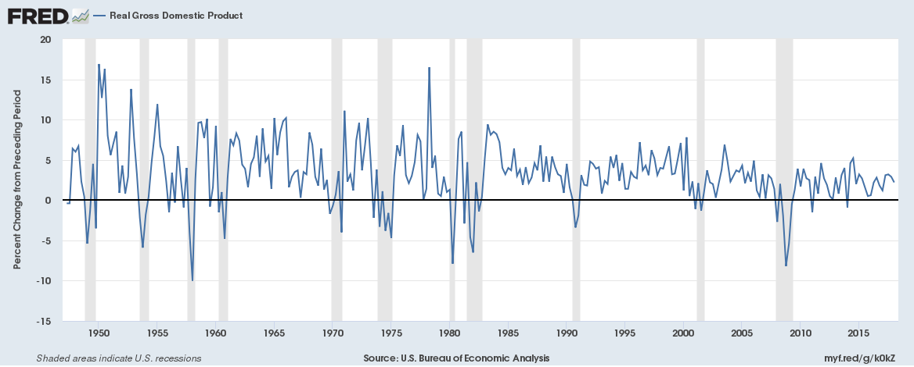

Example Title
=============

*Note: This example is from [here](https://gist.github.com/rt2zz/e0a1d6ab2682d2c47746950b84c0b6ee#file-markdown-sample-md)*

Paragraphs are separated by a blank line.

2nd paragraph. *Italic*, **bold**, and `monospace`. Itemized lists
look like:

  * this one
  * that one
  * the other one

Note that --- not considering the asterisk --- the actual text
content starts at 4-columns in.

> Block quotes are
> written like so.
>
> They can span multiple paragraphs,
> if you like.

Use 3 dashes for an em-dash. Use 2 dashes for ranges (ex., "it's all
in chapters 12--14"). Three dots ... will be converted to an ellipsis.


An h2 header
------------

Here's a numbered list:

 1. first item
 2. second item
 3. third item

Note again how the actual text starts at 4 columns in (4 characters
from the left side). Here's a code sample:

    # Let me re-iterate ...
    for i in 1 .. 10 { do-something(i) }

As you probably guessed, indented 4 spaces. By the way, instead of
indenting the block, you can use delimited blocks, if you like:

```
def foo():
    print("Welcome to flavor country!")
```

(which makes copying & pasting easier). You can optionally mark the
delimited block for Pandoc to syntax highlight it:

```python
import time
# Quick, count to ten!
for i in range(10):
    # (but not *too* quick)
    time.sleep(0.5)
    print i
```

Note that you can also use the tilde `~` to delimit these blocks:

~~~
def bar():
    print("Now with tildes")
~~~


### An h3 header ###

Now a nested list:

 1. First, get these ingredients:

      * carrots
      * celery
      * lentils

 2. Boil some water.

 3. Dump everything in the pot and follow
    this algorithm:

        find wooden spoon
        uncover pot
        stir
        cover pot
        balance wooden spoon precariously on pot handle
        wait 10 minutes
        goto first step (or shut off burner when done)

    Do not bump wooden spoon or it will fall.

Notice again how text always lines up on 4-space indents (including
that last line which continues item 3 above).

Here's a link to [a website](https://github.com/jmbejara/bfi-reu-2018), to a [local
doc](../README.md), and to a [section heading in the current
doc](#an-h2-header). Here's a footnote [^1].

[^1]: Footnote text goes here.

Tables can look like this:

size  material      style
----  ------------  ------------
9     leather       oxford
10    synthetics    tennis
11    plastic       sandal   

Table: Shoes, their sizes, and what they're made of

(The above is the caption for the table.) Pandoc also supports
multi-line tables:

--------  -----------------------
keyword   text
--------  -----------------------
red       Sunsets, apples, and
          other red or reddish
          things.

green     Leaves, grass, frogs
          and other things it's
          not easy being.
--------  -----------------------

You can use a website like this to more easily make Markdown (and LaTeX) tables: https://www.tablesgenerator.com/markdown_tables


A horizontal rule follows.

***

Here's a definition list:

apples
  : Good for making applesauce.
  
oranges
  : Citrus!
  
tomatoes
  : There's no "e" in tomatoe.

Again, text is indented 4 spaces. (Put a blank line between each
term/definition pair to spread things out more.)

Images can be specified like so:



Inline math equations go in like so: $u(c) = \log(c)$. Display
math should get its own line and be put in in double-dollar signs:

$$d V = \rho u(c) + V_x \mu + \frac 12 V_{xx} \sigma^2 $$
There are different flavors of Markdown. GitHub doesn't support equations in their Markdown.

Resources on LaTex:

  - [Lookup LaTeX Symbols](http://detexify.kirelabs.org/classify.html)
  - [LaTeX Cheatsheet](https://wch.github.io/latexsheet/)
  - [LaTeX Templates](https://www.sharelatex.com/templates)

And note that you can backslash-escape any punctuation characters
which you wish to be displayed literally, ex.: \`foo\`, \*bar\*, etc.

# R Markdown and R Notebooks

These document formats use markdown. We will look at these soon.

# Publishing your documents:

See an example on RPubs: https://rpubs.com/carltonlee37/400550
